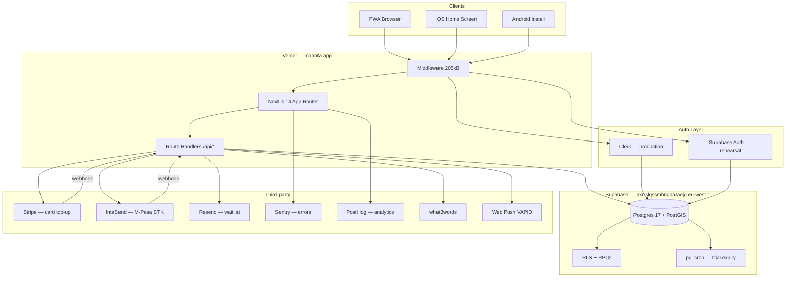
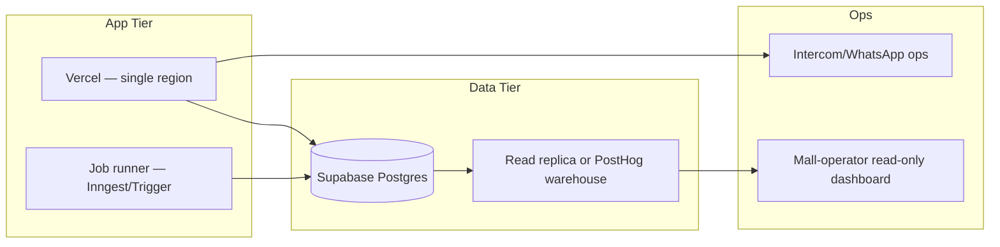

# MAANTA comprehensive company-readiness audit

**Date:** 2026-07-28  
**Status:** Repo-grounded assessment (code + docs on `main` as of audit date)  
**Audience:** Founders, advisors, seed investors, strategic data partners  
**Scope:** Product, engineering, infrastructure, data, operations, commercial model, legal/compliance, partnership readiness

**Related docs (reconciled, not duplicated):**
- `docs/maanta-launch-readiness-tracker.md` — gate tracker
- `docs/ops/tech-stack-deep-dive-2026-07.md` — stack + 100k extension
- `docs/system-design-pre10k.md` — pre-10k baseline
- `docs/skills/launch-audit-2026-07-24.md` — repo vs prod separation
- `docs/maanta-production-rollout-plan.md` — prod apply procedure
- `docs/ops/auth-strategies.md`, `docs/ops/pwa-install.md`, `docs/ops/nodes-nairobi-2026-07.md`

**Evidence legend:** **Confirmed** = verified in code/config/tests this audit. **Inferred** = reasonable conclusion from docs + code. **Unknown** = needs human verification.

---

## 1. Executive overview

### What MAANTA is today

MAANTA is an **in-mall deals platform** where shoppers discover deals at physical malls, claim them in-app to receive a time-limited OTP, and redeem in person at the merchant counter. Merchants pay a **KES 30 success fee** per verified redemption from a prepaid wallet. The platform serves four authenticated personas — shopper, merchant (owner + staff), field agent, and admin — from a **single Next.js PWA** deployed on Vercel, backed by **Supabase Postgres 17** with money-path logic in SECURITY DEFINER RPCs.

**Launch geography:** Node 0 = **BBS Mall, Eastleigh, Nairobi**. Multi-node rehearsal data exists for CBD Galleria and Westlands Hub (synthetic). Target launch window: **November 2026**.

**Confirmed:** Product definition, stack, and frozen business rules match `CLAUDE.md`, `maanta-project-overview.md`, and 67 migrations in `maanta-app/supabase/migrations/`.

### What stage the product is actually at

| Dimension | Stage | Evidence |
|---|---|---|
| **Money path (claim → verify → fee)** | Production-shaped in repo | 16 SQL assertion suites + golden path RPC tests pass in CI |
| **UI surfaces** | Frozen wireframe system shipped | All four personas have routed surfaces; device QA still owed |
| **Auth** | Dual strategy: Clerk (launch) + Supabase email OTP (rehearsal) | `MAANTA_AUTH_STRATEGY` toggle; phone OTP required at claim in Clerk mode |
| **Payments** | Stripe sandbox works; M-Pesa code ready, provider access blocked | Tracker E6 🔴 |
| **Production deployment** | Partially live at `maanta.app`; migration drift documented | Rollout plan § migration reconcile |
| **Marketing / waitlist** | Built in repo; prod verification pending | `/waitlist` → Resend; E7 🟡 |
| **Legal** | Draft policies only; lawyer review blocked on incorporation | `maanta-app/legal/` DRAFT status |
| **Data partnerships** | Not started | No mall-operator dashboard; no data-sharing agreements |

**Bottom line:** MAANTA is a **pre-launch, pilot-capable codebase** with a mature core transaction loop in Postgres, not yet a live marketplace with real Nairobi density.

### Readiness verdicts

| Label | Verdict | Rationale |
|---|---|---|
| **Demo-ready** | ✅ **Yes** | Rehearsal seeds (`node0_100_deals_seed.sql`, `node0_rehearsal_seed.sql`) + `/demo` cheat sheet; works with Supabase auth strategy locally |
| **Pilot-ready** | 🟡 **Conditional** | Requires: prod migrations applied, real Clerk keys, device golden-path pass,至少 10–20 live merchants at BBS |
| **Nairobi Takeover-ready** | 🔴 **No** | Defined below — needs multi-mall density, ops team, data governance, and 10k+ MAU; none exist today |
| **Seed-ready** | 🟡 **Conditional** | Strong technical story + frozen unit economics; weak on legal, GTM proof, prod ops wiring, and density evidence |
| **100k-ready** | 🔴 **No** | Architecture survives with hardening; job runners, analytics separation, SMS cost model, and support ops all missing |

### Red / amber / green by function

| Function | Status | One-line summary |
|---|---|---|
| **Product** | 🟡 | Core flows built; onboarding illustrations placeholder; deal moderation thin; no shopper report flow |
| **Codebase** | 🟢 | 255 vitest + 16 SQL suites; lint/typecheck/build green; money path in RPCs |
| **Infrastructure** | 🟡 | Vercel + Supabase adequate; env/alerting/cron not wired on prod; manual migrations |
| **Data** | 🟡 | Rich operational schema; no warehouse, no partner APIs, no governance framework |
| **GTM** | 🔴 | Waitlist built; landing campaign, email automations, agency handoff largely ⬜ |
| **Legal** | 🔴 | All policies DRAFT; Kenya incorporation undecided; cross-border DPA unresolved |
| **Finance readiness** | 🟡 | Unit economics defined (KES 30); no audited financials; payment processor decision open |
| **Partner readiness** | 🔴 | No mall-operator reporting, no data-sharing contracts, no trust controls for Oracle-style deals |

---

## 2. Product inventory

### System inventory table

| Surface | Route(s) | Purpose | Status | Real / seeded / mock |
|---|---|---|---|---|
| Landing | `/`, `/about`, `/how-it-works`, `/faq`, `/contact` | Marketing | ✅ Shipped | Real (static) |
| Audience pages | `/for-shoppers`, `/for-merchants`, `/merchants`, `/pricing` | Conversion | ✅ Shipped | Real (static) |
| BBS Mall page | `/malls/bbs-mall` | Node 0 landing | ✅ Shipped | Real (static) |
| Waitlist | `/waitlist` | Pre-launch capture → Resend | 🟡 Built | Real API; prod verify pending |
| Download / PWA | `/download` | Install landing + `usePwaInstall` | ✅ Shipped | Real |
| App bootstrap | `/app-bootstrap` | PWA `start_url`; role router via `/api/me` | 🟡 Shipped | **Broken in supabase auth mode** (Clerk-coupled) |
| Auth | `/login`, `/sign-up`, `/verify-phone`, `/auth/callback` | Clerk or Supabase OTP | ✅ Shipped | Real; strategy-dependent |
| Node picker | `/select-mall` | `maanta_node` cookie | ✅ Shipped | Real; 3 live + 2 disabled nodes |
| Shopper feed | `/feed` | Flash / boosted / near-me / favourites rails | ✅ Shipped | Real; needs DB deals |
| Browse | `/browse` | Filterable deal list | ✅ Shipped | Real; client-side filter |
| Map | `/map` | Leaflet pins | ✅ Shipped | Real; needs merchant lat/lng |
| Search | `/search` | Text/type search | ✅ Shipped | Real |
| Deal detail | `/deals/[id]` | Claim CTA | ✅ Shipped | Real → `claim_deal` RPC |
| My deals / tickets | `/my-deals`, `/tickets/[id]` | OTP display + status | ✅ Shipped | Real; auth required |
| Shop storefront | `/shops/[id]` | Public merchant page | ✅ Shipped | Real |
| Profile | `/you`, `/you/notifications`, `/you/help` | Account hub | ✅ Shipped | Real |
| Onboarding splash | `/onboarding` | Welcome panes | 🟡 Placeholder | Mock illustrations |
| Demo cheat sheet | `/demo` | Rehearsal logins | Dev only | Seeded accounts |
| Merchant onboard | `/merchant/onboard` | Wizard → `onboard_merchant` | ✅ Shipped | Real |
| Merchant app | `/merchant/dashboard`, `/redeem`, `/deals/*`, `/wallet`, `/topup`, `/staff`, `/plan` | Full merchant ops | ✅ Shipped | Real |
| Admin | `/admin/*` | Approvals, redemptions, fraud, billing, agents | ✅ Shipped | Real |
| Founder KPIs | `/founder` | Executive dashboard | ✅ Shipped | Real (admin-gated) |
| Agent | `/agent/*` | Lead capture + attribution | ✅ Shipped | Real |
| Legal | `/terms`, `/privacy` | Policy shells | 🟡 Draft | Bracketed placeholders |

### User types and boundaries

| Role | DB value | Primary surfaces | Guard location |
|---|---|---|---|
| Shopper | `customer` | Feed, browse, map, claim | Auth on account pages only |
| Merchant owner | `merchant_admin` | `/merchant/*` | `getMerchantContext()` via `merchants.user_id` |
| Merchant staff | `merchant_staff` | `/merchant/*` (permission flags) | `merchant_staff` table |
| Field agent | `agent` | `/agent/*` | `requireAgentPage()` |
| Admin / founder | `admin` | `/admin/*`, `/founder` | `requireAdminPage()` / `requireFounderPage()` |

**Confirmed:** Five DB roles; `founder`/`cofounder` are routing aliases only, not separate DB enums (`src/lib/auth.ts`, `docs/skills/role-permissions.md`).

### Key flows — detailed status

#### Download → install → bootstrap

1. `/download` — PWA install CTA (Android `beforeinstallprompt` + iOS manual instructions). **Confirmed** in `docs/ops/pwa-install.md`.
2. Manifest `start_url` = `/app-bootstrap`. **Confirmed** in `public/manifest.webmanifest`.
3. `/app-bootstrap` calls `GET /api/me` → `destinationForRole()` → role home.
4. **Gap:** Page uses Clerk `useAuth()`; in `supabase` strategy, ClerkProvider is skipped → bootstrap likely always redirects to login. **Confirmed** in exploration of `src/app/app-bootstrap/`.

#### Shopper claim → redeem

```
/deals/[id] → ClaimFlow (GPS best-effort)
  → POST /api/redemptions (claim_deal RPC, rate-limited 10/60s)
  → phone gate if Clerk mode (403 phone_required → /verify-phone)
  → /tickets/[id] (6-digit OTP, 15-min expiry)
Merchant /merchant/redeem
  → POST /api/redemptions/verify (verify_redemption RPC)
  → Guardian v1 eval → KES 30 fee or arrears
  → verify-anyway preserves shopper UX on unknown fee status
```

**What breaks:** Empty feed without seed or wrong `maanta_node` cookie. Clerk placeholder keys block browser UI. Local Supabase lacks `service_role` table grants without manual fixup.

**What is confusing:** Browse vs map overlap; legacy `?lat&lng` redirects to map; notification prefs are device-local (localStorage), not server-synced.

**Missing for real Nairobi usage:** Swahili/localization (partial — `preferred_language` column exists), offline/low-connectivity UX, M-Pesa for merchants live, on-ground support number operational.

#### Merchant lifecycle

Onboard → pending → admin approve → activate (optional Elite trial + Node 0 KES 300 opening credit) → create deals → top up → redeem at counter.

**Real:** Full RPC chain. **Sandbox:** Stripe + IntaSend test modes. **Manual:** Admin approval queue, dispute resolution, fee reversals (note required).

#### Admin / founder tools

- Merchant approval, ops (shadow-ban, feature flags), location fix
- Guardian held-review queue, dispute uphold/reject, fee reversal with audit
- Customer list (read-only), deal moderation (fraud-event-derived only — no shopper report)
- Agent task queue, billing/trial management, 14-day KPI reports

**Half-built:** Deal moderation lacks shopper-initiated reports (`admin/deals/page.tsx` comment). Stale TODO on merchants page re customer list (customers page exists).

### Seed / demo assumptions

| Assumption | Source |
|---|---|
| Default node = BBS Mall | `src/lib/nodes.ts`, `maanta_node` cookie |
| 100 deals / 60 merchants at Node 0 | `supabase/seed/node0_100_deals_seed.sql` |
| Rehearsal personas (Nuur, Bilan, etc.) | `node0_rehearsal_seed.sql`, `/demo` |
| Nairobi 150-merchant rehearsal | `nairobi_nodes_150_merchants.sql` — 3 live nodes |
| Preset OTP `431977` for Merchant A | `/demo` page |
| Production auth = Clerk + verified phone at claim | Decisions log 2026-07-23 |

### Unused or half-built features

| Feature | Status |
|---|---|
| `authjs` strategy alias | Behaves as supabase; not implemented separately |
| Two Rivers / Sarit nodes | Registry only; `live: false` |
| Social OAuth | Not wired |
| Mall-operator dashboard | Explicitly deferred post-launch |
| Deal drafts | Deferred |
| Self-serve Elite payment | Deferred |
| KYC/AML ongoing monitoring | Legal marks as "proposed, not built" |
| Server-persisted notification preferences | Column planned; device-local today |
| Full offline PWA | SW is push-only, no asset cache |

---

## 3. Technical architecture

### Current-state architecture



### Component inventory

| Layer | Technology | Notes |
|---|---|---|
| Frontend | Next.js 14.2, React 18, Tailwind, Frozen UI | No shadcn/Radix; homegrown components |
| Auth | Clerk (prod) / Supabase Auth (rehearsal) | `MAANTA_AUTH_STRATEGY` env toggle |
| Database | Supabase Postgres 17 | 67 migrations; 16 SQL test suites |
| API | Next.js route handlers | 39 API routes; no Edge Functions |
| Payments | Stripe + IntaSend | Merchant top-ups only; shoppers pay cash off-app |
| Email | Resend | Waitlist + transactional |
| Maps | Leaflet + what3words | Shopper map; merchant location validation |
| Monitoring | Sentry + PostHog | Code integrated; env wiring pending |
| CI | GitHub Actions | lint, typecheck, 255 vitest, build, db-tests |
| Deploy | Vercel | No `vercel.json`; manual `make db-push` for migrations |
| Background jobs | pg_cron only | `handle_trial_expiry` daily 02:00 UTC — **unconfirmed on prod** |
| Caching | `unstable_cache` 30s/node | `getLiveDeals(node)` bucket caps |
| Rate limiting | DB sliding window | claim 10/60s, OTP 20/60s, top-up/onboard/waitlist caps |

### Auth routing and environment strategy

| Env var | Purpose |
|---|---|
| `MAANTA_AUTH_STRATEGY` | `clerk` (default) or `supabase` |
| `NEXT_PUBLIC_MAANTA_AUTH_STRATEGY` | Client-side strategy mirror |
| Clerk keys | Production instance required for browser |
| Supabase JWT | Third-party auth provider for Clerk `sub` → `clerk_user_id` |

**Post-login flow:** `/login` → `/app-bootstrap` → `GET /api/me` → role destination.

**Confirmed:** Full detail in `docs/ops/auth-strategies.md`, `docs/ops/pwa-install.md`.

### Database structure (core)

**Tables (~30):** `users`, `merchants`, `merchant_staff`, `deals`, `redemptions`, `merchant_transactions`, `fee_reversals`, `fraud_events`, `guardian_events`, `agents`, `leads`, `agent_tasks`, `admin_ops_log`, `notifications`, `api_rate_limit_buckets`, `app_config`, `kpi_counters`, `reporting_aggregates`, etc.

**Views:** `merchants_public_browse`, `deals_public_browse`, `vw_active_feed`, `admin_fee_reversal_log`.

**Key RPCs:** `claim_deal`, `verify_redemption`, `record_merchant_ledger_entry`, `reverse_success_fee`, `onboard_merchant`, `activate_merchant`, `handle_trial_expiry`, `guardian_evaluate`, `capture_lead`, `check_rate_limit`.

### Webhooks and cron

| Endpoint / job | Provider | Events |
|---|---|---|
| `POST /api/webhooks/stripe` | Stripe | checkout.session.completed, charge.refunded, charge.dispute.created |
| `POST /api/webhooks/intasend` | IntaSend | M-Pesa STK COMPLETE |
| `maanta_handle_trial_expiry` | pg_cron | `SELECT handle_trial_expiry()` daily |

**No:** Vercel Cron, Inngest, Bull, Supabase Edge Functions, queue workers.

### Vendor dependency map

| Vendor | Criticality | Concentration risk | Fallback |
|---|---|---|---|
| **Vercel** | High — sole host | Single region | Migrate to alternative Node host (high effort) |
| **Supabase** | High — sole DB | Single project `axrrslqssmbngbataejg` | Backup/restore; read replica later |
| **Clerk** | High — prod auth | SMS pricing tied to MAU | Supabase auth (rehearsal only today) |
| **Stripe** | Medium — card top-up | Sandbox; Kenya payout gap | Paystack/Flutterwave per legal research |
| **IntaSend** | Medium — M-Pesa | Access not confirmed | Alternative CBK-licensed provider |
| **Resend** | Low — waitlist | Audience lock-in | Export + migrate |
| **Sentry** | Low — observability | — | Self-host or alternative APM |
| **PostHog** | Low — analytics | EU cloud project 211805 | Export warehouse |
| **what3words** | Low — location | API key | Lat/lng fallback exists |

### Future-state architecture sketch

#### Nairobi Takeover (10k–30k MAU, 5–8 nodes)



#### 100k users

- Add: job queue, analytics warehouse, cursor pagination, CDN/edge cache for browse, dedicated support tooling, fraud ops team, SMS cost governance, optional read replica.
- Keep: Postgres money-path RPCs, Next.js monolith, Clerk auth, Vercel hosting.
- Replace/redesign: reporting on operational DB → warehouse; manual migration deploy → CI-gated pipeline; device-local notification prefs → server-synced.

---

## 4. Codebase and engineering quality

### Test and build posture

| Check | Status | Detail |
|---|---|---|
| Vitest | ✅ **255 tests / 42 files** | Confirmed this audit |
| SQL suites | ✅ **16 files** | CI `db-tests` job via `supabase start` |
| Lint | ✅ Clean | `next lint` |
| Typecheck | ✅ Clean | `tsc --noEmit` |
| Build | ✅ Clean | `next build` with CI placeholder env |
| Playwright E2E | 🟡 Self-skips | Not in default CI; needs dedicated env |
| Device QA | 🟡 Manual owed | E2–E4 in tracker |

### Classification of findings

| Finding | Classification | Notes |
|---|---|---|
| Money path in Postgres RPCs + SQL tests | ✅ Acceptable now | Investor-positive |
| 255 unit tests + frozen-rule ratchet | ✅ Acceptable now | CI enforces money-never-amber |
| Dual auth strategy complexity | 🟡 Should fix soon | `/app-bootstrap` supabase breakage |
| `verify_redemption` redefined 10+ times | 🟡 Should fix soon | Migration hygiene risk; mitigated by SQL tests |
| No background job runner | 🟡 Must fix before scale | Trial expiry, push at volume |
| Playwright not in package.json deps | 🟡 Should fix soon | `test:e2e` may fail |
| Manual `db-push` for prod migrations | 🟡 Investor concern | Process risk as release frequency grows |
| Single-founder key-person risk | 🔴 Investor concern | No bus-factor mitigation documented |
| `founder` not separate DB role | 🟡 Enterprise/partner concern | Fee reversal access = all admins |
| Env sprawl (~40+ vars) | 🟡 Should fix soon | E10 gate; healthz helps |
| `maanta-app/README.md` still create-next-app boilerplate | ✅ Acceptable now | Docs live in CLAUDE.md/AGENTS.md |
| Dead code / duplication | 🟡 Low severity | Some stale TODOs; no major orphan modules found |
| Monitoring code present, ops blind | 🔴 Must fix before seed | Sentry/PostHog env not on Vercel |
| Legal docs DRAFT | 🔴 Investor + partner concern | O5 blocker |
| No social OAuth | ✅ Acceptable now | Not required for launch |
| Service-role SSR for browse | 🟡 Must fix before scale | Blast radius if filter bug |

### Documentation quality

**Strong:** `docs/` has 65+ files including decisions log, skills handoffs, rollout plan, auth strategies, payment rails, redemption disputes, frozen UI rules.

**Weak:** `docs/README.md` index stale (last consolidated 2026-07-09; missing audits, Nairobi seeds, Guardian docs). `maanta-technical-handoff.md` partially stale (waitlist now exists).

### Release discipline

- CI on every PR/push to `main`: lint, typecheck, vitest, build, db-tests.
- Prod migrations: human `make db-push` — documented in rollout plan.
- No automated deploy gate on migration apply.
- **Inferred:** Release discipline is good for a pre-seed repo; ops wiring is the gap.

### DX quality

- Local stack: Docker + `supabase start` + `.env.local` from `.env.example`.
- Makefile targets: `db-verify`, `db-seed-nairobi-150`, `db-prod-fixup`.
- Known local gotcha: `service_role` grants fixup documented in AGENTS.md.
- Node 22 works; CI pins Node 20.

---

## 5. Security, privacy, and compliance baseline

### Auth and session security

| Control | Status | Gap |
|---|---|---|
| Clerk production JWT | 🟡 | Dev instance `cheerful-sailfish-3` still referenced; prod cutover incomplete |
| Phone OTP at claim | ✅ Clerk mode | Supabase rehearsal skips — intentional |
| RLS on core tables | ✅ | Migration hardening suite |
| RPC authorization | ✅ | `service_role`-only money RPCs; role checks in SECURITY DEFINER |
| Rate limiting | ✅ | claim, OTP, top-up, onboard, waitlist |
| Self-role escalation blocked | ✅ | Migration + test |
| Middleware role enforcement | ❌ | Roles enforced in page/API guards only — not middleware |

### PII exposure

| Data | Where | Risk |
|---|---|---|
| Phone numbers | `users`, Clerk | Required at claim; mask in UI (`phone-mask.ts`) |
| Email | `users`, Resend waitlist | Waitlist consent captured |
| GPS at claim | `redemptions` optional | Best-effort; Guardian geofence uses it |
| Merchant financials | `merchants`, ledger | Admin/owner only; financial column guard |
| Push subscriptions | `users.push_subscription` | JSON blob; VAPID-gated |

### OTP / verification handling

- 6-digit OTP, 15-minute expiry, unique pending per merchant.
- OTP never returned in API after initial claim response.
- **Confirmed:** `golden_path_test.sql`, `verify_redemption_money_path_test.sql`.

### Access control and role boundaries

- Five DB roles with guard matrix in `docs/skills/role-permissions.md`.
- Admin ops logged in `admin_ops_log`.
- Fee reversal requires non-empty note (RPC + route enforced).
- **Gap:** No separate founder role; all admins can reverse fees.

### Abuse / fraud risks

| Vector | Mitigation | Residual |
|---|---|---|
| Claim spam | Rate limit 10/60s | Distributed abuse at scale |
| OTP brute force | Rate limit 20/60s; 6-digit space | Merchant-level lockout undefined |
| Collusion shopper-merchant | Guardian v1 velocity/geofence/collusion | Threshold tuning needed from prod data |
| Wallet drain via fake redemptions | Success fee + verify-anyway + dispute path | Ops burden on disputes |
| Waitlist bot signups | Honeypot hardened 2026-07-23 | No CAPTCHA |
| Webhook replay | Idempotent `provider_reference` | Logged failures in `payment_webhook_failures` |

### Audit logging

- `admin_ops_log` — admin actions. **Confirmed.**
- `fee_reversals` — fee reversal audit trail. **Confirmed.**
- `guardian_events` / `fraud_events` — fraud pipeline. **Confirmed.**
- **Missing:** Comprehensive user data access log; GDPR/DPA subject access request workflow.

### Data retention posture

- **Unknown:** No documented retention schedule for redemptions, GPS claims, audit logs.
- **Inferred:** Indefinite retention in Postgres today — partner diligence will ask.

### Incident response readiness

- Sentry integrated for error capture.
- **Missing:** Incident runbook, on-call rotation, breach notification procedure, RTO/RPO targets.
- **Missing:** Status page.

### Privacy policy / consent / governance

| Document | Status | Gap |
|---|---|---|
| `privacy-policy.md` | DRAFT | Bracketed placeholders; cross-border transfer flagged |
| `terms-of-service.md` | DRAFT | Entity name, governing law TBD |
| `kyc-aml-policy.md` | DRAFT | Ongoing monitoring "proposed, not built" |
| `refund-and-wallet-policy.md` | DRAFT | — |
| Cookie consent | **Unknown** | PostHog/Sentry may need consent banner for EU users |
| Kenya DPA 2019 compliance | ⬜ | O6 gate — Supabase in `eu-west-1` |

### Kenya / Nairobi practical considerations

- **Cross-border transfer:** User PII processed in Ireland (Supabase eu-west-1) — needs lawful basis under Kenya Data Protection Act 2019.
- **SMS OTP cost:** Clerk SMS to Kenyan numbers — pricing and deliverability unverified at scale.
- **M-Pesa:** IntaSend or alternative must be CBK-licensed; Stripe Kenya payout gap documented in legal research.
- **Consumer sensitivity:** Deal redemption involves location + phone + purchase intent — high-value for partners, high-risk if mishandled.

### What would worry a mall, council, or data partner in diligence

1. No lawyer-reviewed privacy policy or DPA.
2. No data processing agreement template for partners.
3. No documented retention, deletion, or anonymization policy.
4. No SOC 2 / ISO / independent security audit.
5. Single-tenant architecture with no data isolation story for partner exports.
6. Guardian fraud model not externally validated.
7. Admin access not segregated (founder = admin).
8. No breach notification SLA or insurance.

---

## 6. Data and Oracle-readiness

### Strategic context

Moat priority (founder-stated): **network density first → workflow embedding second → data as byproduct → regulatory deferred**. This audit treats data partnership readiness honestly: the schema generates valuable signals, but governance and trust infrastructure are not yet partner-grade.

### Data asset map

| Asset | Currently generated | Quality | Owner | Partner value |
|---|---|---|---|---|
| Deal inventory + pricing | ✅ `deals`, `merchants` | High for Node 0 seed; unproven live | MAANTA | Mall tenant mix, promotional calendar |
| Claim events | ✅ `redemptions` (pending) | High integrity (RPC) | MAANTA | Shopper intent, deal attractiveness |
| Verified redemptions | ✅ `redemptions` (verified) | High — money-linked | MAANTA | Footfall proxy, conversion proof |
| GPS at claim | ✅ Optional on redemption | Medium — consent unclear | MAANTA | In-mall movement patterns |
| Merchant wallet / fee ledger | ✅ `merchant_transactions` | High — auditable | MAANTA | Merchant engagement, revenue proxy |
| Guardian fraud scores | ✅ `guardian_events` | Medium — v1, tunable | MAANTA | Risk modeling |
| Waitlist segments | ✅ Resend audience | Medium — unverified prod volume | MAANTA | Pre-launch demand signal |
| PostHog behavioral events | 🟡 Instrumented, env-gated | Low until wired | MAANTA | Funnel analytics |
| Agent leads | ✅ `leads` | Medium — manual capture | MAANTA | Merchant pipeline |
| Node-scoped browse | ✅ `maanta_node` + deals | High for multi-mall | MAANTA | Per-mall engagement |
| Shopper favourites | ✅ `merchant_favourites` | Low volume today | MAANTA | Preference signal |
| Verified counts | ✅ RPC aggregates | High | MAANTA | Social proof / popularity |
| **Not generated today** | Mall footfall, POS data, parking, Wi-Fi, council permits | — | Partner | High for Oracle deals |

### What MAANTA could generate credibly by Nairobi Takeover

**Inferred** (requires density assumptions in §8):

- Per-mall, per-category deal claim and redemption rates
- Time-of-day / day-of-week redemption curves by node
- Merchant tier engagement (Standard vs Elite)
- Boost ROI signals (boosted vs organic claims)
- Guardian fraud rate by node
- Shopper repeat redemption rate (cohort retention)
- Agent-assisted merchant activation funnel

### What becomes strategically valuable at 100k users

- **Cohort-level** shopper behavior across malls (anonymized aggregates)
- **Category benchmarks** (fashion vs food redemption rates)
- **Promotional elasticity** (discount depth vs claim rate)
- **Cross-mall shopper journeys** (if multi-node adoption)
- **Merchant churn predictors** (wallet balance, redemption velocity, trial expiry)
- **Fraud model training data** (Guardian outcomes labeled)

### Data quality, schema, provenance, permissions

| Dimension | Status |
|---|---|
| Schema consistency | ✅ Strong — migrations versioned |
| Provenance | 🟡 RPC timestamps; no external data lineage |
| Permissions | ✅ RLS + role guards |
| Ownership | ✅ MAANTA-generated data owned by MAANTA; partner data rights undefined |
| PII in aggregates | 🟡 No documented anonymization pipeline |
| Export APIs | ❌ None for partners |

### Partner data MAANTA would want

| Partner type | Desired data | MAANTA use |
|---|---|---|
| Mall operator | Tenant roster, footfall, floor plans, event calendar | Deal targeting, map accuracy, operator reporting |
| Local council / place data | Business permits, zoning, market days | Merchant verification, location trust |
| Consumer-data org | Aggregated demographic segments (lawful basis) | Shopper acquisition, category mix |

### Partner value proposition map

| Partner | MAANTA offers | MAANTA needs |
|---|---|---|
| **Mall operator** | Digital deal layer, redemption proof, tenant engagement tool, weekly KPI report | Footfall data, tenant list, co-marketing, physical presence |
| **Council / municipal** | Formalized informal commerce, tax-relevant aggregate reporting (if lawful) | Legitimacy, permits data, launch endorsement |
| **Consumer-data org** | Fresh intent + redemption signal in physical retail | Audience segments, compliance framework, distribution |

### Trust blockers (Oracle agreement readiness)

1. **No entity** — Kenya incorporation undecided; cannot sign contracts.
2. **No lawyer-reviewed DPA** or data-sharing agreement template.
3. **No security certification** or third-party pen test.
4. **No data governance committee** or DPO appointment.
5. **No documented anonymization** methodology for aggregate exports.
6. **No partner-facing API** or scheduled report product.
7. **No incident history** — also no incident process.
8. **Prod ops immaturity** — migration drift, monitoring not wired.
9. **Regulatory posture explicitly deferred** — partners may not accept.
10. **Single-founder dependency** — counterparty risk.

### Oracle agreement readiness checklist

| # | Requirement | Status |
|---|---|---|
| 1 | Kenya legal entity incorporated | ❌ |
| 2 | Lawyer-reviewed privacy policy + ToS published | ❌ |
| 3 | Data Processing Agreement template | ❌ |
| 4 | Documented data retention + deletion policy | ❌ |
| 5 | Anonymization / aggregation methodology doc | ❌ |
| 6 | Security whitepaper or pen test report | ❌ |
| 7 | Mall-operator reporting dashboard (read-only) | ❌ Deferred |
| 8 | Scheduled aggregate export (CSV/API) | ❌ |
| 9 | Consent language for data sharing | ❌ |
| 10 | DPO or privacy contact named | ❌ |
| 11 | Cross-border transfer lawful basis (DPA 2019) | ❌ O6 |
| 12 | 90-day pilot with one mall producing audited metrics | ❌ |
| 13 | Independent fraud/integrity review | ❌ |
| 14 | Insurance (cyber + E&O) | **Unknown** |
| 15 | PostHog + Sentry production-active with retention policy | 🟡 |

---

## 7. Commercial model and market readiness

### Value propositions

**Shopper:** Discover in-mall deals, claim with one tap, redeem with OTP at counter. No in-app payment — pay merchant directly (YOU PAY model: `price_kes` + charges).

**Merchant:** Digital deal distribution, verified redemption tracking, prepaid wallet with KES 30 per-success pricing, Elite tier for boosts (KES 500/24h) and visibility.

**Mall operator (aspirational):** Tenant engagement layer — **no product surface today**.

### Pricing and unit logic (frozen)

| Rule | Value | Status |
|---|---|---|
| Success fee | KES 30 per verified redemption | Frozen — not under review |
| Elite trial | 30 days → 7-day grace → downgrade | Implemented; cron unconfirmed on prod |
| Paid Elite | KES 3,500/month | Price review Feb 2027 |
| Boost | KES 500 / 24 hours | Elite-only |
| Node 0 opening credit | KES 300 to first 100 activated merchants | Implemented |
| Verify-anyway | Shopper UX preserved; disputes routed | Implemented |
| Zero-balance gate | No new deals at zero/negative balance | Implemented |
| Top-up settles arrears first | Then credit remainder | Implemented + tested |

### Unproven assumptions

| Assumption | Risk |
|---|---|
| Merchants will prepay wallet before redemptions spike | Arrears path exists but may mask unwillingness to pay |
| KES 30 is acceptable vs value delivered | No live pricing sensitivity data |
| Shoppers will install PWA vs use mobile web | Install funnel not measured (PostHog env pending) |
| BBS Mall density sufficient for viral loops | Node 0 only; no live marketplace |
| Field agents can onboard merchants at pace | Agent flow built; ops process O2 undefined |
| IntaSend or alternative available for M-Pesa | E6 blocker |

### Marketplace density needs

**Inferred from marketplace dynamics:**

- **Minimum viable mall:** ~15–20 active merchants with live deals for shopper return visits.
- **Node 0 target (launch):** 60 merchants seeded; **live** target ~30–40 active in first 30 days.
- **Nairobi Takeover:** 5–8 malls, 200+ active merchants, 10k+ MAU (see §8).

### Dependence on BBS Mall dynamics

- Default `maanta_node` cookie = BBS Mall.
- Opening credit, Guardian thresholds, rehearsal seeds all Node 0-centric.
- BBS operator comms (O4) not started.
- **Risk:** Single-mall dependency until multi-node proves out.

### Operational scaling: support burden

| Scale | Support burden | Bottleneck |
|---|---|---|
| **1k users** | Founder-handled WhatsApp | Merchant onboarding questions (O2 undefined) |
| **10k users** | 1 ops person part-time | Disputes (72h SLA), approval queue, Guardian held reviews |
| **100k users** | 2–3 ops + tooling | Fraud, merchant churn, payment failures, multi-mall reporting |

### Fraud vectors

- Colluding shopper-merchant pairs (Guardian mitigates, not eliminates)
- Arrears accumulation then merchant churn
- Fake merchant onboarding (admin approval is manual gate)
- OTP sharing (social engineering — no technical mitigation)

---

## 8. Nairobi Takeover scenario

### Definition

**Nairobi Takeover** is not a term used in existing repo docs; this audit defines it as an **operational stage** (not a marketing slogan) where MAANTA becomes the default in-mall deal discovery and redemption layer across **most major Nairobi malls**, with measurable density, retention, and partner relationships — not merely "we launched in Nairobi."

| Dimension | Nairobi Takeover means |
|---|---|
| **Geographic** | ≥5 live mall nodes covering Eastleigh, CBD, Westlands, and ≥2 additional major malls |
| **Commercial** | ≥200 active merchants with live deals; ≥50% with ≥1 verified redemption/week |
| **User** | ≥10,000 MAU shoppers; ≥25% monthly retention |
| **Operational** | Dedicated ops support; <24h merchant onboarding SLA; dispute queue <48h average |
| **Partner** | ≥2 signed mall-operator agreements with weekly reporting |
| **Technical** | Prod fully migrated; monitoring active; trial cron running; M-Pesa live |
| **Data** | Aggregate per-mall dashboards; 90-day audited metrics exportable to partners |

### Assumptions

| Metric | Target | Basis |
|---|---|---|
| Mall nodes | 5–8 | Nairobi 150 seed rehearsal + Two Rivers/Sarit registry |
| Active merchants | 200–300 | ~30–40 per mall |
| Live deals | 400–600 | ~2–3 per active merchant |
| Registered shoppers | 30,000–50,000 | Funnel to 10k MAU |
| Monthly verified redemptions | 15,000–25,000 | ~0.5–1 per MAU |
| Success fee revenue | KES 450k–750k/month | 15k–25k × KES 30 |
| Field agents | 5–10 active | Agent attribution built |
| Ops headcount | 2–3 FTE | Onboarding + disputes + partner reporting |

### What must be true

**Product:** Multi-node switcher proven; map/browse performant at 400+ deals; M-Pesa live; push notifications reliable; `/app-bootstrap` fixed for all auth modes.

**Ops:** Merchant support playbook (O2); BBS-style reporting for each mall (O4); agent commission rules documented; on-ground verification at malls.

**Trust:** Lawyer-reviewed policies live; DPA with ≥1 mall operator; dispute SLA met ≥95%.

**Data:** PostHog funnels active; per-node dashboards; monthly aggregate report template.

### Metrics that would prove it

| Metric | Proof threshold |
|---|---|
| MAU | ≥10,000 for 2 consecutive months |
| Merchant activation | ≥200 merchants with ≥1 redemption in 30 days |
| Redemption rate | ≥15,000 verified/month |
| Retention | ≥25% M1 shopper retention |
| Mall coverage | ≥5 nodes with ≥20 active merchants each |
| NPS / qualitative | **Unknown** — not instrumented |
| Partner contracts | ≥2 signed mall operators |

### Team / org capabilities needed

| Role | Count | Purpose |
|---|---|---|
| Founder / CEO | 1 | Partnerships, fundraising, strategy |
| Engineer | 1–2 | Product, infra, migrations |
| Ops / support | 1–2 | Merchant onboarding, disputes |
| Field agents | 5–10 | Merchant acquisition |
| Marketing | 1 or agency | Density campaigns per mall |
| Legal / compliance | External | DPA, contracts (fractional) |

### Manual vs automated at Nairobi Takeover

| Process | Manual | Automated |
|---|---|---|
| Merchant approval | Manual admin review | — |
| Dispute resolution | Manual admin | Guardian auto-hold |
| Fee reversal | Manual with note | RPC execution |
| Trial expiry | Should be automated | pg_cron (wire on prod) |
| Merchant onboarding | Agent-assisted | Self-serve wizard |
| Partner reporting | Manual CSV/export | Dashboard (build) |
| Fraud review | Manual for held items | Guardian auto-flag |
| Top-up reconciliation | Webhook automated | — |

---

## 9. 100,000 users scenario

### Traffic and load expectations

**Inferred** (100k registered, ~30–40% MAU = 30–40k MAU):

| Metric | Estimate |
|---|---|
| Peak concurrent shoppers | 500–2,000 |
| Claims per day | 3,000–10,000 |
| Verifications per day | 2,500–8,000 |
| API requests per day | 500k–2M |
| Feed reads per day | 100k–500k |

### Bottlenecks in Next.js + Supabase + Vercel

| Component | Bottleneck | Severity at 100k |
|---|---|---|
| `getLiveDeals` 30s cache | Stale deals after publish | Low |
| Browse client-side filter | Large per-node payload | Medium |
| `verify_redemption` row locks | Hot merchant counters | Medium |
| Clerk SMS OTP | Cost + rate limits | **High** |
| Supabase connections | Serverless connection pooling | Medium |
| Service-role SSR browse | Blast radius | Medium |
| Reporting on operational DB | Contention with claim/verify | **High** |
| No job queue | Push, lifecycle, bulk ops block requests | **High** |
| Admin list `.limit()` | Incomplete pagination | Medium |

### What survives as-is

- Postgres money-path RPCs (claim, verify, ledger)
- Next.js monolith on Vercel
- Clerk auth architecture
- Frozen UI component system
- Guardian v1 fraud pipeline (with tuning)
- Rate limiting RPC
- Stripe/IntaSend webhook pattern
- 30s node-scoped feed cache (with tag invalidation)

### What needs hardening

- Production env completeness (E10)
- Sentry alerts + PostHog funnels wired
- `handle_trial_expiry` scheduled on prod (E11)
- `/app-bootstrap` auth-strategy fix
- Cursor/keyset pagination for admin/merchant lists
- Cache tag invalidation on deal CRUD
- Connection pooling (Supabase pooler or Prisma/Data API)
- SMS cost model and email-primary login bias

### What needs redesign

- Reporting → read replica or warehouse (PostHog warehouse, Supabase replica, or export)
- Notification preferences → server-persisted
- Partner data export → scheduled aggregates API
- Support tooling → ticketing (not WhatsApp-only)

### What needs replacement

- **Nothing core** at 100k — no mandatory framework rewrite.
- **Possible replacement:** Stripe + IntaSend → single CBK-licensed provider (Paystack/Flutterwave) per legal research.

### What can wait until after seed

- Multi-region deployment
- Full offline PWA
- Social OAuth
- ML-based fraud (Guardian v2)
- Mall-operator self-serve dashboard
- SOC 2 certification
- Dedicated `founder` DB role (unless co-founder joins before seed)

### Cost inflection points

| Service | Inflection |
|---|---|
| Clerk | SMS OTP at 30k+ MAU — potentially KES 100k+/month **Unknown** pricing |
| Supabase | Pro → Team tier; connection limits; storage |
| Vercel | Pro → Enterprise if bandwidth spikes |
| PostHog | Event volume pricing |
| Resend | Audience size |
| what3words | API call volume |

### Observability requirements at 100k

- Sentry: 5xx, webhook failures, claim/verify error rate alerts
- PostHog: signup → claim → verify funnel by node
- Uptime: `/api/healthz?ready=1`
- Supabase: CPU, connections, disk alerts
- Business: daily redemptions, arrears balance, dispute queue depth

---

## 10. Seed-funding readiness

### What an investor would like

1. **Working money path** with SQL test proof — ✅ strongest asset
2. **Frozen unit economics** (KES 30, prepaid wallet) — clear and defensible
3. **Clear wedge** — in-mall deals at BBS Mall, expandable to Nairobi malls
4. **Technical depth** — 67 migrations, Guardian fraud, dual auth for rehearsal
5. **Data optionality** — schema generates footfall-proxy signals (articulate as byproduct, not primary pitch yet)
6. **Agency + waitlist infrastructure** — built, ready to activate
7. **Honest ops docs** — rollout plan, decisions log, launch tracker

### What would raise concern

1. **No live marketplace density** — seeded data ≠ traction
2. **Legal blockers** — DRAFT policies, no incorporation, cross-border DPA open
3. **M-Pesa blocked** — E6; Kenya merchants expect M-Pesa
4. **Prod migration drift** — code ahead of hosted DB
5. **Single-founder / key-person risk**
6. **Marketing gates largely ⬜** — M1–M7
7. **No independent security review**
8. **Monitoring not wired on prod** — "code ready, ops blind"
9. **Payment processor uncertainty** — Stripe Kenya payout gap
10. **Regulatory deferred by strategy** — may worry risk-averse investors

### Data room gaps

| Item | Status |
|---|---|
| Incorporation certificate | ❌ |
| Cap table | **Unknown** |
| Financial statements | **Unknown** |
| Lawyer-reviewed legal docs | ❌ |
| Prod architecture diagram | ✅ This audit |
| Test coverage report | ✅ CI badges / this audit |
| Pilot metrics / LOIs | ❌ |
| Mall operator MOU | ❌ |
| Insurance certificates | **Unknown** |
| Security pen test | ❌ |
| Employee / contractor agreements | **Unknown** |

### Strongest narrative today

> "We've built the full in-mall deal loop — discover, claim, OTP redeem, KES 30 success fee — with fraud checks and admin dispute handling, tested in 16 SQL suites. We're Node 0 at BBS Mall, launching November 2026, with a clear path to Nairobi mall density. The data layer is a byproduct of verified redemptions, not the pitch — but the schema is partner-ready once we have density and governance."

### Still aspirational

- Nairobi Takeover metrics
- Oracle-style data partnerships
- 100k-user scale
- Mall-operator platform
- Network-effects moat (needs density first)

### Seed-readiness checklist

| # | Item | Owner | Status |
|---|---|---|---|
| 1 | Apply all migrations to prod Supabase | Engineer | ⬜ |
| 2 | Wire Vercel prod env (Clerk, Supabase, Sentry, PostHog, Resend) | Engineer | ⬜ E10 |
| 3 | Device golden-path pass (E2–E4) | Engineer + founder | 🟡 |
| 4 | M-Pesa live or credible alternative path | Engineer + founder | 🔴 E6 |
| 5 | Lawyer-reviewed privacy + ToS published | Founder + lawyer | 🔴 O5 |
| 6 | Kenya incorporation decided | Founder | ⬜ |
| 7 | 30+ live merchants at BBS with real redemptions | Ops + agents | ⬜ |
| 8 | Waitlist prod verified + campaign live | Marketing | 🟡 E7 |
| 9 | Pitch deck with honest traction slide | Founder | **Unknown** |
| 10 | Data room folder with this audit + financials | Founder | 🟡 |
| 11 | Monitoring alerts active | Engineer | ⬜ |
| 12 | 90-day pilot plan with measurable KPIs | Founder | ⬜ |

### Data room checklist

- [ ] This comprehensive audit
- [ ] `maanta-decisions-log.md`
- [ ] `maanta-launch-readiness-tracker.md`
- [ ] `maanta-production-rollout-plan.md`
- [ ] `docs/ops/tech-stack-deep-dive-2026-07.md`
- [ ] CI workflow + test counts
- [ ] Legal docs (post-lawyer review)
- [ ] Incorporation docs
- [ ] Cap table
- [ ] Financial model / projections
- [ ] Pilot metrics or LOIs
- [ ] Agency brief + KPI sheet

### Technical diligence appendix

- **Stack:** Next.js 14 + Supabase Postgres 17 + Clerk + Vercel
- **Tests:** 255 vitest + 16 SQL suites (all green on `main`)
- **Money path:** `claim_deal` → `verify_redemption` → `record_merchant_ledger_entry`
- **Security:** PRs #48/#50 hardening; rate limits; RLS; service_role RPC lockdown
- **Migrations:** 67 files; human `make db-push`; drift documented
- **Auth:** Dual strategy; production = Clerk
- **Payments:** Stripe sandbox; IntaSend prepared
- **Monitoring:** Sentry + PostHog integrated, env pending
- **Known tech debt:** No job runner; manual migrations; `/app-bootstrap` supabase bug

### Partnership diligence appendix

- **Data generated:** Redemptions, claims, merchant ledger, Guardian events, node-scoped browse
- **Data not generated:** Mall footfall, POS, council permits
- **Governance gaps:** No DPA template, no retention policy, no anonymization doc, no export API
- **Trust prerequisites:** Incorporation, lawyer review, 90-day pilot, security review
- **Recommended sequence:** Density at BBS → mall operator weekly report → DPA with 1 mall → aggregate export API → council/consumer-data conversations

---

## 11. Prioritized roadmap

### Top 10 urgent fixes

| # | Item | Owner | Severity | Why | Output |
|---|---|---|---|---|---|
| 1 | Apply prod migrations + reconcile drift | Engineer | **Critical** | Code depends on pending migrations | Prod DB matches `main` |
| 2 | Wire Vercel prod env (E10) | Engineer | **Critical** | App non-functional without | healthz green |
| 3 | Fix `/app-bootstrap` for supabase strategy | Engineer | **High** | Rehearsal routing broken | Strategy-agnostic bootstrap |
| 4 | Confirm `handle_trial_expiry` on prod (E11) | Engineer | **High** | Elite billing integrity | Cron job verified |
| 5 | M-Pesa path unblocked or alternative (E6) | Founder + engineer | **Critical** | Kenya merchant expectation | Live STK test |
| 6 | Device golden-path QA (E2–E4) | Engineer + founder | **High** | Launch gate | Signed QA checklist |
| 7 | Lawyer review kickoff (O5) | Founder | **Critical** | Seed + partner blocker | Review schedule |
| 8 | Merchant support process (O2) | Founder + AI lead | **High** | Ops scaling | Support playbook |
| 9 | Sentry + PostHog env on Vercel | Engineer | **High** | Ops blindness | Alerts + funnels live |
| 10 | Waitlist prod verification (E7) | Engineer + founder | **High** | Marketing gate | First prod signup confirmed |

### Next 30-day actions

| Action | Owner | Dependency | Output |
|---|---|---|---|
| Complete prod rollout plan phases 1–3 | Engineer | Migration access | Prod on current `main` |
| Run Node 0 rehearsal at maanta.app | Founder + engineer | #1, #2 | Rehearsal checklist signed |
| Activate waitlist campaign skeleton | Agency + founder | #10 | Landing + form live |
| Document SMS cost model for Clerk | Engineer + founder | Clerk prod keys | Cost ceiling doc |
| BBS operator intro email sent (O4) | Founder | — | First operator meeting |
| Schedule Kenya incorporation consult | Founder | — | Entity decision timeline |
| Onboard 10 live BBS merchants (non-seed) | Agents + founder | #1, #5 | Real merchant IDs |

### Next 90-day actions

| Action | Owner | Dependency | Output |
|---|---|---|---|
| 30+ live merchants at BBS with redemptions | Ops + agents | 30-day items | Traction metrics |
| Marketing campaign live (M1–M4) | Agency | Waitlist verified | Campaign KPIs |
| Kenya incorporation completed | Founder + lawyer | Legal consult | Entity registered |
| Privacy + ToS published | Lawyer | Incorporation | Live legal pages |
| M-Pesa or Paystack/Flutterwave live | Engineer | E6 resolution | Merchant top-up proof |
| PostHog funnel dashboard | Engineer | #9 | Conversion visibility |
| Mall-operator weekly report v1 (manual) | Founder | 30+ merchants | First operator report |
| Playwright E2E in CI (optional) | Engineer | Test env | CI gate |

### Before seed

- Prod fully migrated and env-wired
- ≥30 live merchants with verified redemptions at BBS
- Lawyer-reviewed legal docs published
- Kenya incorporation decided (ideally completed)
- M-Pesa or approved payment alternative live
- Monitoring + alerts active
- Data room assembled (this audit + financials + cap table)
- Honest traction slide (redemptions, merchants, waitlist — not downloads)

### Before Oracle / data-partner outreach

- All "before seed" items
- ≥90 days of audited per-mall redemption data
- DPA template lawyer-reviewed
- Data retention + anonymization policy documented
- ≥1 signed mall-operator agreement with weekly reporting
- Aggregate export (manual CSV minimum)
- Security review or pen test completed
- DPO or privacy contact named
- Cross-border transfer lawful basis resolved (O6)

### Before Nairobi Takeover

- All data-partner prerequisites (or explicit partner waiver)
- 5+ live mall nodes
- 200+ active merchants
- 10k MAU for 2 consecutive months
- Ops team ≥2 FTE
- Mall-operator dashboard (read-only)
- Job runner for lifecycle ops
- M-Pesa dominant top-up rail

### Before 100k

- Analytics warehouse or read replica
- Cursor pagination on all admin/merchant lists
- Job queue (Inngest/Trigger.dev)
- Support ticketing system
- SMS cost governance + email-primary bias
- Connection pooling optimized
- Fraud ops playbook
- Optional: SOC 2 Type I started

---

## Appendix A: Risk register

| ID | Risk | Likelihood | Impact | Mitigation | Status |
|---|---|---|---|---|---|
| R1 | Prod migration drift causes outage | High | Critical | Rollout plan execution | Open |
| R2 | IntaSend unavailable at launch | Medium | High | Paystack/Flutterwave fallback | Open |
| R3 | Clerk SMS cost prohibitive at scale | Medium | High | Email-primary; phone at claim only | Planned |
| R4 | Legal delay blocks launch | High | Critical | November trip prep | Open |
| R5 | Single-founder key-person | High | High | Hire engineer + ops post-seed | Open |
| R6 | Empty feed on wrong node cookie | Medium | Medium | Default + validation exists | Mitigated |
| R7 | Cross-border DPA violation | Medium | High | Lawyer review O6 | Open |
| R8 | Guardian false positives anger merchants | Medium | Medium | Tunable thresholds | Mitigated |
| R9 | Arrears accumulation / merchant churn | Medium | Medium | Zero-balance gate | Mitigated |
| R10 | Partner data breach reputational damage | Low | Critical | No partner data yet | N/A |

## Appendix B: Readiness matrix

| Capability | Demo | Pilot | Seed | Nairobi Takeover | 100k | Oracle partner |
|---|---|---|---|---|---|---|
| Claim → verify loop | ✅ | ✅ | ✅ | ✅ | ✅ | ✅ |
| Multi-node | 🟡 seed | 🟡 | 🟡 | ✅ | ✅ | ✅ |
| M-Pesa live | ❌ | 🟡 | ✅ | ✅ | ✅ | ✅ |
| Legal published | ❌ | 🟡 | ✅ | ✅ | ✅ | ✅ |
| Live merchant density | ❌ | 🟡 | 🟡 | ✅ | ✅ | ✅ |
| Monitoring/alerts | 🟡 | ✅ | ✅ | ✅ | ✅ | ✅ |
| Data export | ❌ | ❌ | 🟡 | ✅ | ✅ | ✅ |
| DPA / governance | ❌ | ❌ | 🟡 | ✅ | ✅ | ✅ |
| Job runner | ❌ | ❌ | 🟡 | ✅ | ✅ | ✅ |
| Analytics warehouse | ❌ | ❌ | ❌ | 🟡 | ✅ | ✅ |

## Appendix C: Files, routes, env vars, and docs reviewed

### Codebase (confirmed 2026-07-28)

- `maanta-app/package.json`, `next.config.mjs`, `vitest.config.ts`
- `maanta-app/src/middleware.ts`, `src/lib/auth.ts`, `src/lib/auth/strategy.ts`
- `maanta-app/src/lib/data.ts`, `src/lib/nodes.ts`, `src/lib/pwa/app-bootstrap.ts`
- `maanta-app/src/app/` — 76 page routes, 39 API routes (full inventory §2)
- `maanta-app/supabase/migrations/` — 67 files
- `maanta-app/supabase/tests/` — 16 SQL suites
- `maanta-app/supabase/seed/` — node0, nairobi, rehearsal, test accounts
- `maanta-app/legal/` — 6 files
- `maanta-app/public/manifest.webmanifest`, `public/sw.js`
- `.github/workflows/ci.yml`
- `Makefile`
- `.env.example`

### Environment variables (from `.env.example`)

`MAANTA_AUTH_STRATEGY`, `NEXT_PUBLIC_MAANTA_AUTH_STRATEGY`, `NEXT_PUBLIC_SUPABASE_URL`, `NEXT_PUBLIC_SUPABASE_ANON_KEY`, `SUPABASE_SERVICE_ROLE_KEY`, `NEXT_PUBLIC_CLERK_PUBLISHABLE_KEY`, `CLERK_SECRET_KEY`, `NEXT_PUBLIC_CLERK_SIGN_IN_URL`, `NEXT_PUBLIC_CLERK_SIGN_UP_URL`, `NEXT_PUBLIC_APP_URL`, `NEXT_PUBLIC_LAUNCH_AUTH_MODE`, `STRIPE_SECRET_KEY`, `STRIPE_WEBHOOK_SECRET`, `STRIPE_ENV`, `INTASEND_API_KEY`, `INTASEND_SECRET`, `INTASEND_WEBHOOK_SECRET`, `INTASEND_ENV`, `SENTRY_DSN`, `NEXT_PUBLIC_SENTRY_DSN`, `SENTRY_AUTH_TOKEN`, `POSTHOG_PROJECT_KEY`, `POSTHOG_HOST`, `NEXT_PUBLIC_POSTHOG_PROJECT_TOKEN`, `NEXT_PUBLIC_POSTHOG_HOST`, `RESEND_API_KEY`, `RESEND_AUDIENCE_ID`, `RESEND_FROM_EMAIL`, `NEXT_PUBLIC_VAPID_PUBLIC_KEY`, `VAPID_PRIVATE_KEY`, `VAPID_SUBJECT`, `W3W_API_KEY`, E2E vars.

### Documentation reviewed

- `CLAUDE.md`, `AGENTS.md`
- `docs/README.md`, `docs/maanta-project-overview.md`, `docs/maanta-decisions-log.md`
- `docs/maanta-launch-readiness-tracker.md`, `docs/maanta-launch-ops-runbook.md`
- `docs/maanta-technical-handoff.md`, `docs/maanta-production-rollout-plan.md`
- `docs/system-design-pre10k.md`
- `docs/ops/tech-stack-deep-dive-2026-07.md`, `docs/ops/auth-strategies.md`
- `docs/ops/pwa-install.md`, `docs/ops/nodes-nairobi-2026-07.md`
- `docs/ops/merchant-lifecycle.md`, `docs/ops/e2e-golden-path.md`
- `docs/skills/launch-audit-2026-07-24.md`, `docs/skills/payments-rails.md`
- `docs/skills/redemption-disputes.md`, `docs/skills/clerk-auth.md`
- `docs/skills/role-permissions.md`, `docs/skills/prod-auth-deals-recovery.md`
- `docs/maanta-guardian-v1.md`
- `docs/maanta-marketing-agency-brief.md`, `docs/maanta-waitlist-data-schema.md`

### CI verification (this audit)

```
vitest: 42 files, 255 tests passed
lint: clean
build: success
```

---

*This audit is a repo-grounded snapshot. Reconcile with Notion for operational decisions that may have moved since 2026-07-28. Behavior truth remains in code + migrations.*
