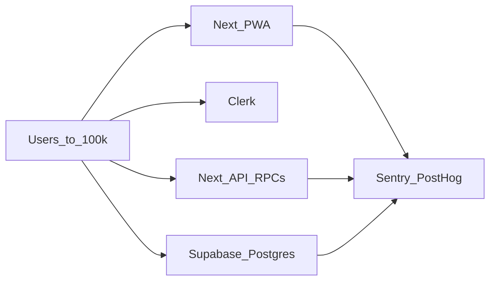

# Maanta tech stack deep dive & path to ~100,000 users

Last updated: 2026-07-28 · Status: **repo-grounded assessment** (docs only).  
Audience: founders + technical / infra / AI / merchant-experience advisors.

This extends [docs/system-design-pre10k.md](../system-design-pre10k.md) from
“Node 0 launch / pre-10k” to an honest look at what holds (and what breaks)
on the journey to ~100k users. Every claim below cites code or config in this
repo — not generic SaaS advice.

Related: [clerk-auth](../skills/clerk-auth.md),
[auth-strategies](./auth-strategies.md),
[pwa-install](./pwa-install.md),
[sentry-monitoring](../skills/sentry-monitoring.md),
[architecture-audit-now-fixes](../skills/architecture-audit-now-fixes-2026-07-26.md),
[payments-rails](../skills/payments-rails.md),
[role-permissions](../skills/role-permissions.md),
[nodes-nairobi](./nodes-nairobi-2026-07.md).

---

## 1. Current tech stack inventory

### Frontend / app

| Component | What we use | Where |
|---|---|---|
| Framework | **Next.js 14.2.35** App Router (exact pin), React 18.3 | `maanta-app/package.json`, `maanta-app/src/app/` |
| UI | Tailwind 3.4 + homegrown “Frozen UI” / Claude-calm components — **no** shadcn/Radix/MUI | `tailwind.config.ts`, `src/components/ui/`, `src/components/ui/claude/` |
| Maps | Leaflet + react-leaflet (shopper `/map`) | `package.json` |
| Fonts | DM Sans, Inter, JetBrains Mono via `next/font/google` | `src/app/layout.tsx` |
| PWA manifest | `start_url: /app-bootstrap`, `display: standalone` | `public/manifest.webmanifest` |
| Service worker | **Push + notification click only** — no offline asset cache | `public/sw.js` |
| Install landing | `/download` — `usePwaInstall` + Android/iOS fallback copy | `src/app/(public)/download/`, `src/lib/pwa/usePwaInstall.ts` |
| Role bootstrap | `/app-bootstrap` — client router via `GET /api/me` + `destinationForRole` | `src/app/app-bootstrap/`, `src/lib/pwa/app-bootstrap.ts` |
| Install UX | Home `InstallPrompt` bottom sheet (reuses hook) + links to `/download` | `src/components/install-prompt.tsx` |

**Still true:**

- No `src/lib/roles.ts` — roles and guards live elsewhere (see Auth / roles).

**Role-based routing** (middleware does **not** enforce app roles — only session):

| Guard | File | Allows |
|---|---|---|
| `requireAdminPage` / `requireAdminApi` | `src/lib/admin.ts` | `admin` |
| `requireFounderPage` / `requireFounderApi` | `src/lib/founder.ts` | `admin` (founder ≡ admin) |
| `requireAgentPage` / `requireActiveAgentApi` | `src/lib/agent.ts` | `agent` or `admin` |
| Merchant layout / `requireMerchant` | `src/lib/merchant.ts`, `merchant-api.ts` | owner or staff via `merchants` / `merchant_staff` |

Post-login destination (Clerk + Supabase email): **`/app-bootstrap`** → role home
(`customer` → `/feed`, merchants → `/merchant/dashboard`, `admin` → `/admin`,
`agent` → `/agent`). See `docs/ops/pwa-install.md`.

---

### Auth

| Piece | Reality in repo |
|---|---|
| Strategy toggle | `MAANTA_AUTH_STRATEGY` / `NEXT_PUBLIC_MAANTA_AUTH_STRATEGY` — `clerk` (launch default) or `supabase` (dev/test email OTP) | `src/lib/auth/strategy.ts`, `docs/ops/auth-strategies.md` |
| Launch provider | **Clerk** via conditional `AuthProviders` → `ClerkProvider` | `src/components/auth/auth-providers.tsx` |
| Dev/test provider | **Supabase Auth** email OTP (`SupabaseEmailLogin`) — no Clerk keys required | `src/components/auth/supabase-email-login.tsx` |
| Middleware | Clerk middleware **or** Supabase session refresh by strategy | `src/middleware.ts`, `src/lib/supabase/middleware.ts` |
| Data authz | Supabase RLS / `current_user_id()` — Clerk JWT `sub` → `clerk_user_id`, or Supabase Auth UUID → `auth_uid` | `src/lib/auth.ts` |
| Launch strategies | Email + phone OTP via Clerk; claim requires verified phone (`/verify-phone`) when `phoneOtpEnabled()` | `src/lib/auth.ts`, `src/app/verify-phone/` |
| Social OAuth | **No app wiring** |
| Twilio Verify | Marked legacy/unused in `.env.example` |
| Clerk instance | `cheerful-sailfish-3` (see `supabase/config.toml`, clerk-auth skill) |

**DB / app roles** (`AppRole` in `src/lib/auth.ts`, CHECK on `public.users.role`):

`customer` | `merchant_admin` | `merchant_staff` | `agent` | `admin`

`founder` / `cofounder` are **not** database roles. `/founder` is gated by `admin`.
`destinationForRole` maps reserved `founder`/`cofounder` strings to `/founder` for future enum use.

---

### Backend & data

| Piece | Reality |
|---|---|
| Primary DB | Supabase **Postgres 17** (local CLI + hosted project `axrrslqssmbngbataejg`) |
| Schema source of truth | `maanta-app/supabase/migrations/` (+ SQL suites in `supabase/tests/`) |
| App API | Next.js route handlers under `src/app/api/*`: claim/verify, deals, top-ups, webhooks (Stripe/IntaSend), admin, push, waitlist, healthz, **`/api/me`** |
| Money path | SECURITY DEFINER RPCs: `claim_deal`, `verify_redemption`, `record_merchant_ledger_entry`, Guardian helpers — see `golden_path_test.sql` |
| Clients | User JWT client (`src/lib/supabase/server.ts`); process-cached **service role** (`src/lib/supabase/service.ts`) used widely for SSR/browse |
| Waitlist | **Resend** audience proxy (`/api/waitlist`) — not a Postgres table |
| Background jobs | **None in-repo** (no Inngest/Bull/Edge Functions/Vercel cron config). `handle_trial_expiry()` exists as a DB function awaiting scheduled invoke (launch tracker E11 still open) |
| Rate limits | DB sliding window via `check_rate_limit` + `src/lib/rate-limit.ts` (claim 10/60s, OTP 20/60s, top-up/onboard/waitlist caps) |
| Nodes | Multi-mall registry (BBS Mall default + CBD/Westlands rehearsal) | `src/lib/nodes.ts`, Nairobi seed docs |

**Core tables (baseline + later migrations):** `users`, `merchants`, `deals`, `redemptions`, `merchant_transactions`, `leads`, `agents`, `agent_tasks`, `fraud_events` / `guardian_events`, `notifications`, `admin_ops_log`, `api_rate_limit_buckets`, browse views, etc.

**Hot-read pattern:** `getLiveDeals(node)` — three capped bucket queries (flash/boosted/standard) + `verified_counts_by_merchant` RPC, wrapped in `unstable_cache` for **30s** per node (`src/lib/data.ts`). Browse filters that payload client-side (chips: Ending soon, Flash, Favourites).

**Hot-path indexes (selected):** node+live deals, `(merchant_id, status)` on redemptions, unique pending OTP per merchant — see migration `20260726200000_architecture_now_fixes.sql`.

---

### Ops & infra

| Piece | Reality |
|---|---|
| Hosting | **Vercel** for the Next app (`www.maanta.app`); no `vercel.json` in repo |
| Database host | Hosted Supabase; migrations via human `make db-push` (`Makefile`) |
| Payments | Stripe (sandbox during testing) + IntaSend M-Pesa prep — merchant top-ups only |
| Email | Resend (waitlist + transactional); Supabase Auth email OTP in `supabase` strategy |
| CI | `.github/workflows/ci.yml` — lint, typecheck, vitest, build; parallel `db-tests` (`supabase start` + `tests/*.sql`). Opt-in Playwright: `e2e.yml` |
| Monitoring | **Sentry** (`@sentry/nextjs`, `withSentryConfig`) + **PostHog** (client provider + server `src/lib/analytics.ts` + `/ingest` rewrite). Both no-op until env DSNs/tokens are set |
| Health | `GET /api/healthz` (+ `?ready=1` for env readiness) |
| Not present | Datadog, New Relic, LogRocket, in-repo job runners |

---

## 2. Scalability assessment for ~100,000 users

Rough framing: ~100k users means many more concurrent shoppers, merchants, and
redemptions than Node 0, still likely one primary region (Nairobi → Kenya),
with multi-mall (`node`) growth before true multi-region.

### Frontend

**Strengths (keep):**

- Single App Router app is a normal Vercel scale shape for 100k MAUs if pages stay light and SSR/cache is intentional.
- Feed is **capped** (bucket limits) and **cached 30s per node** — avoids unbounded deal lists.
- Homegrown UI keeps bundle surface smaller than a heavy component library.
- `/download` + `/app-bootstrap` give a coherent install → role-home path for PWA.

**Weaknesses (will hurt before/at 100k):**

- Service worker is **not** an offline/cache PWA — fine for install + push, but marketing “app-like offline” expectations are unmet (`public/sw.js`).
- Browse does **client-side** filtering over the live-deal payload — OK at Node 0 deal counts; painful if live inventory grows large per node.
- Admin/merchant lists use small `.limit(...)` windows, not cursor/keyset pagination.

**Verdict:** **Keep Next + Frozen UI as-is; augment caching/pagination and error UX.** Do not rewrite the frontend for 100k.

---

### Auth

**Strengths (keep):**

- Production-shaped launch path: Clerk for identity, Supabase for RLS/data (`docs/skills/clerk-auth.md`).
- Dev/test **supabase** strategy avoids Clerk SMS cost during rehearsal (`docs/ops/auth-strategies.md`) — good for scale *practice*, not a launch substitute.
- Phone verification gated at claim (high-fraud surface) while login can be email+phone.
- App roles live in Postgres (auditable, RPC-visible), not only Clerk metadata.
- Central `/app-bootstrap` keeps post-login routing role-based rather than hard-coded per surface.

**Weaknesses:**

- SMS OTP cost and Clerk rate limits become the binding constraint at 100k MAUs — **pricing/plan**, not architecture.
- Placeholder/dev Clerk keys break interactive browser (FAPI “Invalid host”) — already documented in `AGENTS.md`; launch must use a real production project with `MAANTA_AUTH_STRATEGY=clerk`.
- No social OAuth in app code yet — optional later for acquisition, not required for scale correctness.
- `founder`/`cofounder` not separated from `admin` — governance risk as the team grows (fee reversal access).

**Verdict:** **Keep Clerk for launch; harden production plan, SMS strategy, and role separation.** Use supabase strategy only for rehearsal. Not “replace auth framework.”

---

### Database / backend

**Strengths (keep):**

- Money path in SECURITY DEFINER RPCs + SQL assertion suites is the right trust model for fees/wallets.
- Architecture-now fixes already address PostgREST’s silent **1000-row cap** for verified counts and admin revenue aggregates.
- Hot-path indexes and unique pending OTP exist.
- App-level rate limits on claim/OTP/top-up/onboard.
- Multi-node columns + Nairobi seed/registry exist for BBS → Nairobi expansion.

**Weaknesses:**

- No scheduled runner for `handle_trial_expiry` in production (tracker E11).
- No job queue for push, lifecycle scoring, or heavy notifications — request-path only.
- Reporting still largely on the operational DB; heavy analytics at 100k can contend with claim/verify.
- Widespread **service-role** SSR for browse — correct for public feed today, but increases blast radius if a bug bypasses intended filters (mitigated by `withPublicMerchant` / browse views).
- Multi-node reporting at Kenya scale still thin vs single-node launch.

**Verdict:** **Keep Postgres + RPC money path; augment reads, cron/workers, and analytics separation.** Do not move the ledger out of Postgres.

---

### Infra / monitoring

**Strengths:**

- Sentry + PostHog are **already integrated in code** — unusual and good for this stage.
- CI covers lint/typecheck/unit + DB SQL suites.
- Health endpoint exists for uptime probes.

**Weaknesses (where you’d be blind at scale):**

- Blindness is mostly **ops wiring**, not missing libraries: DSN/tokens on Vercel still human-owned; alerts for 5xx / auth spikes / slow routes are not defined in-repo.
- No Datadog (or similar) APM — acceptable if Sentry performance + Vercel + Supabase metrics are turned on first.
- Deploy/migrations are manual (`db-push`) — fine early; process risk grows with release frequency.
- No multi-region; acceptable until Kenya-wide traffic justifies it.

**Verdict:** **Keep Vercel + Supabase + Sentry + PostHog; finish env, alerts, and capacity dashboards before adding another APM.**

---

## 3. Path to 100,000 users — concrete upgrades

Prioritized for BBS Mall → Nairobi → Kenya. Prefer finishing what is already
scaffolded over introducing parallel platforms.

### Frontend

1. **Keep feed bucket caps + 30s node cache**; invalidate via cache tags on deal CRUD when that path ships.
2. Add **cursor/keyset pagination** for admin/merchant redemption and lead lists (today: small `.limit`).
3. At multi-mall scale, consider **longer CDN/ISR/edge cache** for public browse payloads (still invalidate on publish).
4. Strengthen **auth/network failure UX** (signed-out claim, Clerk outage, empty vs error feed — feed already distinguishes DB failure vs empty).
5. Treat full offline SW caching as **optional product work**, not a scale prerequisite — current SW is correctly scoped to push; `/download` already covers install education.

### Auth

1. Production launch: **`MAANTA_AUTH_STRATEGY=clerk`** with a real Clerk project, SMS/email limits and pricing (not placeholder keys).
2. Keep **phone OTP for claim**; prefer email (and later social) for browse/login to control SMS spend.
3. Document an **SMS cost ceiling** and fallback (email-primary login; phone only when claiming) if Clerk SMS becomes prohibitive — supabase strategy is rehearsal-only, not that fallback.
4. When co-founders need restricted access, add a dedicated **`founder` role** (or Clerk org permissions) so fee-reversal stays admin-only — deferred today on purpose.
5. Keep **`/app-bootstrap`** as the single post-login / PWA start entry so new roles only update `destinationForRole`.

### Database / backend

1. **Schedule `handle_trial_expiry`** (pg_cron or external cron hitting a locked admin/service endpoint) — close launch tracker E11.
2. Keep using **SQL aggregate RPCs** for counts/revenue; add denormalized counters only if RPC cost shows up in prod metrics.
3. Before heavy BI: **read replica or warehouse** (Supabase replica / PostHog warehouse / export) so reporting does not slow claim/verify.
4. Introduce a **job runner** (e.g. Inngest, Trigger.dev, or Supabase Edge + queue) when push volume and lifecycle updates leave the request path.
5. Revisit **indexes** as multi-node live deal volume grows; watch redemption `(merchant_id, status, redeemed_at)` style access patterns.
6. Preserve **rate-limit RPC**; tune bucket sizes from production abuse data, not guesses.

### Infra / monitoring

1. Set **Sentry DSN** (`SENTRY_DSN`, `NEXT_PUBLIC_SENTRY_DSN`) and PostHog tokens on Vercel — code is ready (`docs/skills/sentry-monitoring.md`).
2. Sentry **alerts**: spike in 5xx, payment webhook failures (`logWebhookFailure`), claim/verify error rates, auth failure spikes.
3. PostHog **funnels**: signup → claim → verify; segment by `node`.
4. Uptime probe on **`/api/healthz?ready=1`**.
5. Supabase dashboard alerts: CPU, connections, disk; Vercel latency for critical API routes.
6. Add Datadog (or similar) **only if** Sentry + platform metrics prove insufficient — avoid tool sprawl.

---

## 4. Collaboration map

How advisors should use this stack map:

### Technical Advisor (UK)

- Focus: App Router surfaces, RPC money path (`claim_deal` / `verify_redemption` / ledger), Vitest + `supabase/tests/*.sql`, role guards in `src/lib/{admin,agent,founder,merchant}.ts`, auth strategy toggle correctness.
- Ask them to challenge: pagination, cache invalidation, service-role blast radius, PostgREST cap footguns, `/app-bootstrap` edge cases.

### Infra Advisor (Manchester)

- Focus: Vercel env completeness (Clerk + strategy vars + Sentry/PostHog), alerts, Supabase capacity and backups, scheduling `handle_trial_expiry`, future workers/cron, CI → deploy hygiene (`make db-push` discipline).
- Ask them to close the “code wired, ops blind” gap before multi-mall traffic.

### Applied AI Advisor

- Focus: data that must be clean before models — `leads`, merchant lifecycle fields (`merchant-lifecycle.ts` / ops doc), `guardian_*` events, PostHog event taxonomy, `reporting_aggregates` / admin RPCs.
- Ask them to prioritize **instrumentation + labeling** (fraud outcomes, verify-anyway, arrears) over early model training at &lt;10k.

### Merchant Experience Advisor

- Focus: where tech choices hit the till — redeem latency (verify RPC), wallet/top-up reliability (Stripe/IntaSend webhooks), zero-balance deal-create gate, verify-anyway trust UX, push notification reliability (`sw.js` + VAPID), PWA install friction (`/download`).
- Ask them to define merchant SLOs (e.g. verify success under N seconds) that infra/engineering can alert on.

---

## 5. Surprises vs common assumptions

| Assumption | Repo reality |
|---|---|
| `/download` + `/app-bootstrap` still missing | **Shipped** — install landing + role router; manifest `start_url` is `/app-bootstrap` |
| Auth is Clerk-only everywhere | **Dual strategy** — Clerk for launch, Supabase email OTP for rehearsal |
| `src/lib/roles.ts` + founder/cofounder roles | **No** — five DB roles; founder UI = admin |
| Need to “add Sentry/PostHog for 100k” | **Already in code** — finish Vercel env + alerts |
| Background job platform exists | **No** — trial expiry function awaits schedule |
| Auth is still prototype-only | **No** — launch path is production-shaped; SMS **cost** is the scale risk |
| Feed will N+1 at scale | **Mitigated** — bucket queries + verified-counts RPC + 30s cache |

---

## 6. Relationship to other docs

| Doc | Relationship |
|---|---|
| `docs/system-design-pre10k.md` | Launch / pre-10k baseline — this doc is the 100k extension |
| `docs/ops/pwa-install.md` | Install + bootstrap routes detailed here at summary level |
| `docs/ops/auth-strategies.md` | Clerk vs supabase strategy toggle |
| `docs/skills/architecture-audit-now-fixes-2026-07-26.md` | Shipped read-path correctness fixes to keep |
| `docs/maanta-launch-readiness-tracker.md` | Human-owned gates (trial cron, env wiring) that unblock scale |
| `docs/maanta-production-rollout-plan.md` | Promote-to-live process; not replaced by this assessment |
